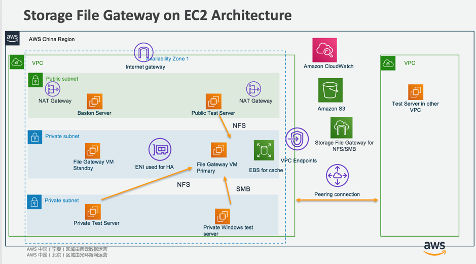

# storage-gateway-demo

Storage File Gateway POC architecture

## Part1: Storage File Gateway on EC2
[StorageGW on EC2](StorageGWonEC2.md)

# The protocols supported by file gateway
File gateway supports Linux clients connecting to the gateway using Network File System (NFS) versions 3 and 4.1 for Linux clients, and supports Windows clients connecting to the gateway using Server Message Block (SMB) versions 2 and 3.

Your NFS or SMB client can write, read, delete, rename, and truncate files.

[Getting Started Test File Share](https://docs.aws.amazon.com/storagegateway/latest/userguide/GettingStartedTestFileShare.html)

**NOTE: Keep in mind these points about how file gateways work with S3:**
- File gateways don't support creating hard or symbolic links on a file share.
- Reads are served from a read-through cache. In other words, if data isn't available, it's fetched from S3 and added to the cache.
- Writes are sent to S3 through optimized multipart uploads by using a write-back cache.
- Read and writes are optimized so that only the parts that are requested or changed are transferred over the network.
- Deletes remove objects from S3.
- Directories are managed as folder objects in S3, using the same syntax as in the Amazon S3 console. You can rename empty directories.
- Recursive file system operation performance (for example ls –l) depends on the number of objects in your bucket.

# How does file gateway manage the local cache?

Local disk storage on the gateway is used to temporarily hold changed data that needs to be transferred to AWS, and to locally cache data for low-latency read access. File gateway automatically manages the cache maintaining the most recently accessed data based on client read and write operations. Data is evicted from the cache only when space is needed to store more recently used data.

To maximize write performance, the gateway uses a write-back mechanism where data is first persisted to disk and then asynchronously uploaded to S3. The gateway serves data from the local cache to maximize read performance. If not present, data is efficiently synchronously fetched from Amazon S3 using byte-range gets.

If the cache is too small then read latencies will increase as data being requested must be fetched from S3, and writes could fail if there is no free cache space to store data locally pending upload to S3.

# When does data in the cache get evicted?

Data written to the cache from your applications or through retrieval from Amazon S3 is evicted from the cache only when space is needed to store more recently accessed data.

[Monitoring cache refresh](https://docs.aws.amazon.com/storagegateway/latest/userguide/monitoring-file-gateway.html#refresh-cache-notification)

# Monitoring
https://docs.aws.amazon.com/storagegateway/latest/userguide/monitoring-file-gateway.html
