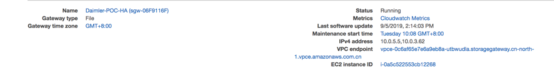

# Storage Gateway - File Gateway on EC2

[File Gateway on EC2 official guide](https://docs.aws.amazon.com/storagegateway/latest/userguide/ec2-gateway-file.html)

[Create File Gateway guide](https://docs.aws.amazon.com/storagegateway/latest/userguide/create-gateway-file.html)

# Create File Gateway

1. Create File Gateway on EC2


Create a second EBS volume which used for cache. The cache EBS volume is 200GiB / 4000 iops and root volume is 80GiB / 4000 iops

2. Only allowed Storage Gateway access from VPC endpoint via privateLink


3. Using private IP of EC2 to connect the gateway VM (Note, you need open this page on baston server)

Type the IP address of your gateway VM. Your web browser must be able to connect to this IP address. The IP address doesn't need to be accessible from outside your network.

您可以使用分配到网关的公共或私有 IP 地址来激活。您必须能够从执行激活的浏览器访问所使用的 IP 地址。比如使用公有 IP / EIP地址来激活网关, 或者使用跳板机访问私有地址.


4. Storage Gateway overview




5. After you delete the file share or File Gateway, the EC2 instance will running, you need terminate manually

# For security consideration
[Network consideration](https://docs.aws.amazon.com/storagegateway/latest/userguide/Requirements.html#networks)

[Resource_Ports](https://docs.aws.amazon.com/storagegateway/latest/userguide/Resource_Ports.html)

- The EC2 is on private subnet without public IP assigned
- Only allowed Storage Gateway access from VPC Storage Gateway endpoint via privateLink
- The security group for storage gateway
    - TCP 22
    - TCP 80 – active GW console
    - TCP 111 – Data transfer
    - TCP 2049 – NFS
    - TCP 20048 – NFSv3
    - TCP 139 - SMBv2
    - TCP 445 – SMBv3

- The security group for VPC endpoint
    - TCP 443
    - TCP 1026
    - TCP 1027
    - TCP 1028
    - TCP 1031
    - TCP 2222

[The gateway-private-link](https://docs.aws.amazon.com/storagegateway/latest/userguide/gateway-private-link.html)

- The mount point IP is private IP
- S3 bucket encryption


# Linux Mount testing

## Linux NFS Mount testing
### Client in the same AZ public subnet
```bash
[ec2-user@ray-demo-tools ~]$ sudo mkdir -p /mnt/filegateway-nfs
[ec2-user@ray-demo-tools ~]$ sudo mount -t nfs -o nolock,hard 10.0.1.60:/ray-storagegw-nfs /mnt/filegateway-nfs

[ec2-user@ray-demo-tools ~]$ for i in `seq -w 1 10`; do sudo cp -rp /var/log/messages /mnt/filegateway-nfs/filegateway-nfs-copy-test-$i; done
[ec2-user@ray-demo-tools ~]$ ls -lA /mnt/filegateway-nfs/filegateway-nfs-copy-test* | wc -l
10
```


Check the S3 bucket


### Cilent on other VPC within same region
- Update the security group to allow other testing server in other VPC to mount
- Update the file share access setting to add the target CIDR blocks
- Setup the VPC peering
- Update your routing table for both sides’ connection go through VPC Peering connection

```bash
[ec2-user@ip-172-16-180-167 ~]$ sudo mount -t nfs -o nolock,hard 10.0.5.5:/ray-storagegw-nfs-ha /mnt/stgnfs
```


The tesitng result:

1. Automatically sync
2. create new file and check other instance will be synced
3. upload file to S3 bucket, the file will NOT synced
4. delete from S3, the file kept on the file system
5. delete from file system, S3 bucket object will be delete


## SMB / CIFS Mount on Linux testing
Create different file share SMB and CIFS: ray-storagegw-smb

```bash
[ec2-user@ray-demo-tools ~]$ sudo yum install -y cifs-utils

# You need using username=smbguest,password=POC-Password,domain=sgw-06F9116F as mount options
[ec2-user@ray-demo-tools mnt]$ sudo mount.cifs -o nolock,hard -o username=smbguest,password=POC-Password,domain=sgw-06F9116F //10.0.5.5/ray-storagegw-smb /mnt/cifs-storagegw-smb

# Add below line to /etc/fstab for persistent mount after reboot
//10.0.5.5/ray-storagegw-smb /mnt/cifs-storagegw-smb  cifs _netdev,username=smbguest,password=POC-Password,domain=sgw-06F9116F 0 0

[ec2-user@ray-demo-tools ~]$ for i in `seq -w 1 10`; do sudo cp -rp /var/log/messages /mnt/cifs-storagegw-smb/cifs-storagegw-smb-copy-test-$i; done
[ec2-user@ray-demo-tools ~]$ ls -lA /mnt/cifs-storagegw-smb/cifs-storagegw-smb-copy-test* | wc -l
10
```


# Windows Mount testing
- [mount-nfs-share-windows-10](https://graspingtech.com/mount-nfs-share-windows-10/)

- [windows nfs-overview](https://docs.microsoft.com/en-us/windows-server/storage/nfs/nfs-overview)

## Windows NFS mount
```bash
mount -o nolock -o mtype=hard 10.0.5.5:/ray-storagegw-nfs H:
```


They are the same as file shared NFS mount to Linux 


## Windows SMB mount
Follow up the guide to [create the SMB file share](https://docs.aws.amazon.com/storagegateway/latest/userguide/CreatingAnSMBFileShare.html)

Create different file share SMB and CIFS: ray-storagegw-smb

The mount options:
1. net command
```bash
#Doesn't persist across system reboots, unless you use the /persistent:(yes:no)switch. 
net use T: \\10.0.5.5\ray-storagegw-smb /user:sgw-06F9116F\smbguest
```


Create folder and write files to network driver


Check the S3 bucket


```bash
# Disconnect the T: driver and connect again by re-run
net use T: \\10.0.5.5\ray-storagegw-smb /user:sgw-06F9116F\smbguest
The folder and files does not lost.
```

2. The CmdKey command line utility – Creates a persistent connection to a mounted SMB file share that remains after a reboot.
```bash
cmdkey /add:10.0.5.5 /user:sgw-06F9116F\smbguest /pass:POC-Password
```

A network drive mapped in File Explorer – Configures the mounted file share to reconnect at sign-in and to require that you enter your network credentials.


3. PowerShell script – Can be persistent, and can be either visible or invisible to the operating system while mounted. [Not tested in this POC]

